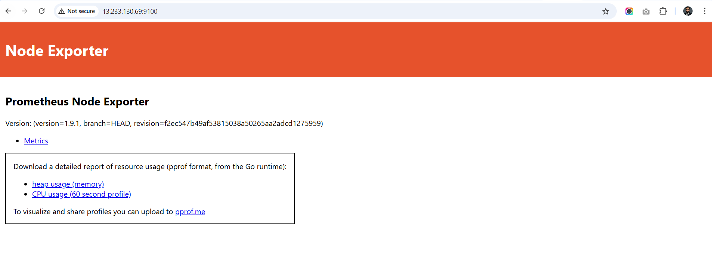

### 🛡️ Capstone-02: Container Vulnerability Scanner with Real-Time Monitoring & Alerting

> *Automated CVE scanning for container images using Trivy, integrated with CI/CD, Slack alerts, and Grafana dashboards.*

---

## 🧰 Tools & Technologies

| Category              | Tools & Technologies                                  |
|-----------------------|--------------------------------------------------------|
| 💻 Programming        | Python, Bash                                           |
| 🐞 Vulnerability DB   | [CVE](https://cve.mitre.org/) via **Trivy**            |
| 📢 Notifications      | Slack                                                  |
| 🔄 CI/CD              | Jenkins                                                |
| 📊 Monitoring         | Prometheus, Grafana, Pushgateway, Node Exporter         |
| 🐳 Containerization   | Docker                                                 |

---

## 🗂️ Repository Structure

```
capstone-02/
├── Dockerfile
├── README.md
├── app.py
├── config
│   ├── exceptions.yaml
│   ├── grafana
│   │   ├── dashboards
│   │   │   └── vulnerability-dashboard.json  ← Grafana Dashboard Config
│   │   └── provisioning
│   │       ├── dashboards
│   │       │   └── dashboards.yml
│   │       └── datasources
│   │           └── prometheus.yml
│   ├── prometheus
│   │   └── prometheus.yml                       ← Prometheus Config
│   └── trivy-config.yaml                        ← Trivy Configuration
├── docker-compose.yml                           ← Multi-service Orchestration
├── metrics
│   └── prometheus_exporter.py                   ← Custom Metrics Exporter
├── notifications
│   └── slack_notifier.py                        ← Slack Alert Sender
├── reporting
│   └── report_generator.py                      ← Scan Report Generator
├── requirements
│   └── app.txt                                  ← App-specific Dependencies
├── requirements.txt                             ← Global Python Dependencies
├── scanner
│   ├── exception_manager.py                     ← Whitelist/Exception Handler
│   ├── rescan_scheduler.py                      ← Scheduled Rescans
│   ├── retry_handler.py                         ← Retry Logic for Failed Scans
│   └── trivy_scanner.py                         ← Core Trivy Integration
└── scripts
    ├── ci_scanner.py                            ← CI Trigger Script (Jenkins)
    ├── push_metrics.py                          ← Push Metrics to Pushgateway
    ├── slack_notify.py                          ← CLI Wrapper for Slack Alerts
    └── threshold_checker.py                     ← Fail Build if Threshold Breached
```

---

## 🚀 Getting Started

### 1. 🌐 Create GitHub Repository

✅ **Step-by-step guide to initialize your repo:**

1. Go to [GitHub.com](https://github.com/) and sign in.
2. Click the **"+"** icon → **“New repository”**.
3. Fill in:
   - **Repository name**: `capstone-02`
   - **Description**: *Container vulnerability scanner with real-time monitoring & Slack alerts.*
   - **Visibility**: 🔒 **Private**
4. ✅ Check **“Add a README file”**
5. ✅ Optionally add `.gitignore` (e.g., Python template)
6. Click **“Create repository”**

> 💡 *Tip: Clone locally after creation:*
> ```bash
> git clone https://github.com/your-username/capstone-02.git
> cd capstone-02
> ```

---

## ⚙️ Install & Configure Trivy

### ➕ Install on Ubuntu

```bash
# Add GPG key
sudo apt-get install wget gnupg
wget -qO - https://aquasecurity.github.io/trivy-repo/deb/public.key | gpg --dearmor | sudo tee /usr/share/keyrings/trivy.gpg > /dev/null

# Add repo
echo "deb [signed-by=/usr/share/keyrings/trivy.gpg] https://aquasecurity.github.io/trivy-repo/deb generic main" | sudo tee -a /etc/apt/sources.list.d/trivy.list

# Install
sudo apt-get update
sudo apt-get install trivy
```

### ✅ Verify Installation

```bash
trivy --version
```


### 🧪 Test Scan

Scan a sample image for critical/high vulnerabilities:

```bash
trivy image --severity CRITICAL,HIGH nginx:latest
```


---

### 🔧 Install Docker Engine

After opening the terminal, follow these steps:

- Install Docker
- Add your user to the Docker group
```bash
sudo curl -fsSL https://get.docker.com | sudo sh

# Add Your User to the Docker Group
sudo usermod -aG docker $USER
newgrp docker
```

## 🔍 How Trivy Integrates with CVE Databases

### 📘 What is CVE?

**CVE (Common Vulnerabilities and Exposures)** is a standardized list of publicly known cybersecurity vulnerabilities managed by:

- [MITRE](https://cve.mitre.org/)
- [NVD (National Vulnerability Database)](https://nvd.nist.gov/)

Each CVE includes:
- Unique ID (e.g., `CVE-2024-12345`)
- Description & CVSS Severity Score
- Affected software versions
- Patch availability status

---


### 🤖 Trivy + CVE = Real-Time Scanning

Trivy automatically syncs with multiple upstream sources including:

- **OS Packages**: Alpine, Debian, Ubuntu, Red Hat, etc.
- **Language Libraries**: Python (pip), Node.js (npm), Java (jar), etc.
- **GitHub Advisories**, **GitLab Advisories**, **Vulnerability DBs**

> ✅ **No manual updates needed** — Trivy checks for latest DB on every scan (unless cached).

---

### 📖 Step for Monitoring Stack (Prometheus + Grafana + Pushgateway + Node Exporter)

---

## 1. Overview

This Docker Compose configuration brings up a **monitoring stack** composed of the following services:

- **Prometheus** – Scrapes metrics from exporters and stores them.  
- **Grafana** – Provides beautiful dashboards and querying against the Prometheus data source.  
- **Pushgateway** – Allows ephemeral or batch jobs to push metrics to Prometheus.  
- **Node Exporter** – Collects machine-level metrics (CPU, memory, filesystem, etc.).

The stack provides:
- Prometheus at **http://localhost:9090**  
- Grafana at **http://localhost:3000**  
- Pushgateway at **http://localhost:9091**  
- Node Exporter at **http://localhost:9100**  

---

#### 2. Service by Service Explanation

##### 2.1 Prometheus
```yaml
 prometheus: 
    image: prom/prometheus:latest
    container_name: prometheus
    volumes:
      - ./config/prometheus/prometheus.yml:/etc/prometheus/prometheus.yml
      - prometheus_data:/prometheus
    command:
      - '--config.file=/etc/prometheus/prometheus.yml'
      - '--storage.tsdb.path=/prometheus'
      - '--web.console.libraries=/etc/prometheus/console_libraries'
      - '--web.console.templates=/etc/prometheus/consoles'
      - '--web.enable-lifecycle'
    ports:
      - "9090:9090"
    restart: unless-stopped
```

- **Image**: Uses the official Prometheus image.  
- **Volumes**:  
  - `./config/prometheus/prometheus.yml` → mounts a YAML config file from the host into the container.  
  - `prometheus_data` → Docker-managed persistent volume for storing metric history (so you don’t lose data when container restarts).  
- **Command flags**:  
  - `--config.file` = where Prometheus reads its configuration (scrape targets, job definitions, etc.).  
  - `--storage.tsdb.path=/prometheus` = where data is stored (points to the volume).  
  - Console flags define where Prometheus can find its web UI console templates.  
  - `--web.enable-lifecycle` = lets you trigger configuration reloads or shutdown via HTTP calls.  
- **Ports**: Exposes 9090 (Prometheus web UI).  
- **Restart policy**: Always restart unless stopped manually.


---

### 2.2 Grafana
```yaml
  image: grafana/grafana:latest
    container_name: grafana
    volumes:
       - grafana_data:/var/lib/grafana
       - ./config/grafana/provisioning:/etc/grafana/provisioning
       - ./config/grafana/dashboards:/var/lib/grafana/dashboards
    environment:
      - GF_SECURITY_ADMIN_USER=${GRAFANA_USER:-admin}
      - GF_SECURITY_ADMIN_PASSWORD=${GRAFANA_PASSWORD:-admin}
      - GF_INSTALL_PLUGINS=grafana-piechart-panel
    ports:
      - "3000:3000"
    restart: unless-stopped
    depends_on:
      - prometheus
```

- **Image**: The latest Grafana image.  
- **Volumes**:  
  - `grafana_data` → persistent storage for Grafana’s internal DB (e.g., users, dashboards).  
  - Provisioning folder for automated setup of datasources and dashboards.  
  - Dashboards mapped so you can drop JSON files that Grafana will load.  
- **Environment variables**:  
  - Default admin user/password are defined here, but can also be overridden via environment (`GRAFANA_USER`, `GRAFANA_PASSWORD`).  
  - Example plugin installed: `grafana-piechart-panel`.  
- **Ports**: Exposes **3000** (Grafana web UI).  
- **depends_on**: Waits for Prometheus to be ready before starting.

---

### 2.3 Pushgateway
```yaml
    pushgateway:
    image: prom/pushgateway:latest
    container_name: pushgateway
    ports:
      - "9091:9091"
    restart: unless-stopped
```
- **Role**: A bridge for **ephemeral jobs or scripts** that cannot be scraped directly by Prometheus.  
- **Ports**: Exposes 9091.  

Think of it like a mailbox where your short-lived cron jobs drop letters (metrics) for Prometheus to come pick up later.


---

### 2.4 Node Exporter
```yaml
  node-exporter:
    image: prom/node-exporter:latest
    container_name: node-exporter
    volumes:
      - /proc:/host/proc:ro
      - /sys:/host/sys:ro
      - /:/rootfs:ro
    command:
      - '--path.procfs=/host/proc'
      - '--path.rootfs=/rootfs'
      - '--path.sysfs=/host/sys'
      - '--collector.filesystem.mount-points-exclude=^/(sys|proc|dev|host|etc)($$|/)'
    ports:
      - "9100:9100"
    restart: unless-stopped
```
- **Role**: Collects metrics about the **host system** (CPU, RAM, disk, filesystem usage, OS info, etc.)  
- **Volumes**: Mounts host system directories (`/proc`, `/sys`, `/`) in read-only mode so it can read system metrics.  
- **Command overrides**: Ensures proper paths inside container.  
- **Ports**: Exposes **9100**.

This is basically Prometheus’ stethoscope for your server’s body.



---

### 2.5 Volumes
```yaml
volumes:
  prometheus_data:
  grafana_data:
```
- Named Docker volumes for **persistent storage**.  
- Ensures data isn’t lost when containers are recreated.

---

## 3. Folder Structure (suggested)

```
capston-02/
├── docker-compose.yml
├── config/
│   ├── prometheus/
│   │   └── prometheus.yml
│   └── grafana/
│       ├── provisioning/
│       │   ├── datasources/
│       │   └── dashboards/
│       └── dashboards/
```

- `prometheus.yml` defines scrape jobs (tell Prometheus where to scrape—Node Exporter, Pushgateway, etc.).  
- Grafana provisioning makes Grafana automatically recognize Prometheus as its datasource.

---

## 4. Running the Stack

Steps:  
1. Ensure you have **Docker + Docker Compose** installed.  
2. Place the `docker-compose.yml` and config files in your project folder.  
3. Start everything:  
   ```bash
   docker-compose up -d
   ```  
4. Verify services:
   - Prometheus → [http://localhost:9090](http://localhost:9090)  
   - Grafana → [http://localhost:3000](http://localhost:3000) (login with admin/admin or values set)  
   - Pushgateway → [http://localhost:9091](http://localhost:9091)  
   - Node Exporter → [http://localhost:9100/metrics](http://localhost:9100/metrics)  

---

## 5. Prometheus Configuration Example (`prometheus.yml`)

At minimum, Prometheus needs to know where to scrape services. Example:

```yaml
global:
  scrape_interval: 15s
  evaluation_interval: 15s

alerting:
  alertmanagers:
    - static_configs:
        - targets: []

rule_files:
  - "alerts.yml"

scrape_configs:
  - job_name: 'prometheus'
    static_configs:
      - targets: ['localhost:9090']

  - job_name: 'pushgateway'
    static_configs:
      - targets: ['pushgateway:9091']
    honor_labels: true

  - job_name: 'node'
    static_configs:
      - targets: ['node-exporter:9100']
```

This way Prometheus collects metrics from itself, Node Exporter, and Pushgateway.

---

## 6. Grafana Setup

With proper provisioning in `config/grafana/provisioning`:
- Grafana **datasource** automatically connects to Prometheus (`http://prometheus:9090`).  
- You can load ready-made dashboards from Grafana’s dashboard library (e.g., Node Exporter mixin).  
- Persist across restarts thanks to `grafana_data` volume.

---


#### ⚙️ Environment Variables

### Step‑by‑Step: Adding Secrets in GitHub

1. **Navigate to Repository Settings**  
   - Go to your repository on GitHub.  
   - Click on the **⚙ Settings** tab (you’ll only see this if you have admin/main access).

2. **Find Secrets Section**  
   - In the left sidebar, scroll to **Security > Secrets and variables > Actions**.  
   - Select **Secrets**, then click **New repository secret**.

3. **Add Secret Name & Value**  
   - **Name**: Define a descriptive and uppercase name (e.g. `API_KEY`, `DB_PASSWORD`).  
   - **Value**: Paste the sensitive string (such as an API key or token).  
   - Click **Add secret**.

Set these as **GitHub Secrets** for security:

| Variable Name            | Example                                                                   | Usage               |
| ------------------------ | ------------------------------------------------------------------------- | ------------------- |
| SLACK_WEBHOOK_URL     | https://hooks.slack.com/services/XXXXX/12XXX                                                       | AWS authentication  |
| PROMETHEUS_PUSHGATEWAY  | http://13.233.130.69:9091                                     | AWS authentication  |
|

### Security Notes
- **Never hardcode secrets** directly in workflow files.  
- Use **repository**, **environment**, or **organization** level secrets depending on scope.  
- Rotate keys regularly like you’d rotate tires—except it’s less greasy, more secure.

### Github action workflow

- Create workflow `.github/workflows/vulnerability-scan.yml`

```yml
name: Container Security Pipeline
run-name: ${{ github.actor }} for Container Image Vulnerability Scanner with Reporting

on:
  push:
    branches: [ main, develop ]
  pull_request:
    branches: [ main ]
  schedule:
    - cron: '0 2 * * *'  # Daily scan at 2 AM

env:
  DOCKER_IMAGE: ${{ github.repository }}:${{ github.sha }}

jobs:
  build-and-scan:
    runs-on: ubuntu-latest

    steps:
    - name: Checkout code
      uses: actions/checkout@v4
    
    - name: Set up Python
      uses: actions/setup-python@v4
      with:
        python-version: '3.12'

    - name: Install dependencies
      run: |
        python3 -m pip install --upgrade pip
        pip install -r requirements.txt

    - name: Install Trivy
      run: |
        sudo apt-get install wget gnupg
        wget -qO - https://aquasecurity.github.io/trivy-repo/deb/public.key | gpg --dearmor | sudo tee /usr/share/keyrings/trivy.gpg > /dev/null
        echo "deb [signed-by=/usr/share/keyrings/trivy.gpg] https://aquasecurity.github.io/trivy-repo/deb generic main" | sudo tee -a /etc/apt/sources.list.d/trivy.list
        sudo apt-get update
        sudo apt-get install trivy

    - name: Build Docker Image
      run: |
        docker build -t ${{ env.DOCKER_IMAGE }} .

    - name: Run Vulnerability Scan
      id: scan
      run: |
        python3 scripts/ci_scanner.py \
          --image "${{ env.DOCKER_IMAGE }}" \
          --output-format json \
          --output-file scan-results.json

    - name: Upload Scan Results
      uses: actions/upload-artifact@v4
      with:
        name: vulnerability-scan-${{ github.sha }}
        path: scan-results.json
        retention-days: 30

    - name: Check Vulnerability Thresholds
      id: threshold_check
      run: |
        python3 scripts/threshold_checker.py \
          --scan-results scan-results.json \
          --config config/trivy-config.yaml

    - name: Send Slack Notification
      if: always()
      run: |
        python3 scripts/slack_notify.py \
          --scan-results scan-results.json \
          --webhook-url ${{ secrets.SLACK_WEBHOOK_URL }}

    - name: Push Metrics to Prometheus
      if: always()
      run: |
        python scripts/push_metrics.py \
          --scan-results scan-results.json \
          --pushgateway ${{ secrets.PROMETHEUS_PUSHGATEWAY }}

    - name: Comment PR
      if: github.event_name == 'pull_request'
      uses: actions/github-script@v6
      with:
        script: |
          const fs = require('fs');
          const scanResults = JSON.parse(fs.readFileSync('scan-results.json', 'utf8'));
          
          const comment = `## 🔍 Vulnerability Scan Results
          
          **Image:** ${scanResults.image}
          **Total Vulnerabilities:** ${scanResults.total_vulnerabilities}
          
          ### Severity Breakdown
          - 🔴 Critical: ${scanResults.severity_summary.CRITICAL}
          - 🟠 High: ${scanResults.severity_summary.HIGH}
          - 🟡 Medium: ${scanResults.severity_summary.MEDIUM}
          - 🟢 Low: ${scanResults.severity_summary.LOW}
          
          [View Full Report](https://github.com/${{ github.repository }}/actions/runs/${{ github.run_id }})`;
          
          github.rest.issues.createComment({
            issue_number: context.issue.number,
            owner: context.repo.owner,
            repo: context.repo.repo,
            body: comment
          });
```

This is a **GitHub Actions CI/CD workflow** for building a Docker image, scanning it for vulnerabilities, reporting results, notifying stakeholders, and tracking metrics.

## **Workflow Header**
```yaml
name: Container Security Pipeline
run-name: ${{ github.actor }} for Container Image Vulnerability Scanner with Reporting
```
- **`name`**: Friendly label shown in the Actions UI — here it’s "Container Security Pipeline."
- **`run-name`**: Dynamic label visible in the workflow runs list. It will show *who triggered it* (via `github.actor`) plus some context.

---

## **Triggers**
```yaml
on:
  push:
    branches: [ main, develop ]
  pull_request:
    branches: [ main ]
  schedule:
    - cron: '0 2 * * *'
```
This workflow runs when:
1. **Code is pushed** to `main` or `develop`.
2. **A pull request targets `main`.**
3. **On a schedule** — daily at 2 AM UTC (configured by cron).

So it’s basically: run on PRs, main pushes, and a daily “health scan.”

---

#### **Global Environment Variable**
```yaml
env:
  DOCKER_IMAGE: ${{ github.repository }}:${{ github.sha }}
```
- Defines a global variable `DOCKER_IMAGE`.
- It names/tag the Docker image with:
  - The repository name
  - The commit SHA  
E.g., **`my-org/my-repo:abc123def`**. This ensures each build image is uniquely identifiable.

---

## **The Job**
```yaml
jobs:
  build-and-scan:
    runs-on: ubuntu-latest
```
There’s a single job called `build-and-scan`. It runs on GitHub’s Ubuntu runner (fresh virtual machine).

## **Step by Step Within the Job**

1. **Checkout Code**
   ```yaml
   - name: Checkout code
     uses: actions/checkout@v4
   ```
   Pulls your repo code into the runner so the rest of the workflow can use it.

2. **Set up Python**
   ```yaml
    - name: Set up Python
      uses: actions/setup-python@v4
      with:
        python-version: '3.12'
   ```
   Ensures Python 3.12 is installed and ready.

3. **Install Python Dependencies**
   ```yaml
   - name: Install dependencies
      run: |
        python3 -m pip install --upgrade pip
        pip install -r requirements.txt
   ```
   Standard Python setup: upgrade `pip` and install dependencies.

4. **Install Trivy**
   ```yaml
   - name: Install Trivy
      run: |
        sudo apt-get install wget gnupg
        wget -qO - https://aquasecurity.github.io/trivy-repo/deb/public.key | gpg --dearmor | sudo tee /usr/share/keyrings/trivy.gpg > /dev/null
        echo "deb [signed-by=/usr/share/keyrings/trivy.gpg] https://aquasecurity.github.io/trivy-repo/deb generic main" | sudo tee -a /etc/apt/sources.list.d/trivy.list
        sudo apt-get update
        sudo apt-get install trivy
   ```
   Trivy = ⭐ open-source vulnerability scanner for Docker images and filesystems.  
   This step adds Aqua Security’s repo → installs Trivy.

5. **Build Docker Image**
   ```yaml
   - name: Build Docker Image
      run: |
        docker build -t ${{ env.DOCKER_IMAGE }} .
   ```
   Builds the Docker image from the repository’s `Dockerfile`, tagging it with the commit SHA.

6. **Run Vulnerability Scan**
   ```yaml
   - name: Run Vulnerability Scan
      id: scan
      run: |
        python3 scripts/ci_scanner.py \
          --image "${{ env.DOCKER_IMAGE }}" \
          --output-format json \
          --output-file scan-results.json
   ```
   Instead of directly calling `trivy`, you use a custom Python wrapper (`ci_scanner.py`).  
   - Scans the built image  
   - Produces `scan-results.json` in JSON format
   
7. **Upload Scan Results (Artifact)**
   ```yaml
   - name: Upload Scan Results
      uses: actions/upload-artifact@v4
      with:
        name: vulnerability-scan-${{ github.sha }}
        path: scan-results.json
        retention-days: 30
   ```
   Stores results as a downloadable artifact in GitHub → so humans can check results later.

8. **Check Vulnerability Thresholds**
   ```yaml
   - name: Check Vulnerability Thresholds
      id: threshold_check
      run: |
        python3 scripts/threshold_checker.py \
          --scan-results scan-results.json \
          --config config/trivy-config.yaml
   ```
   This script enforces policies. Example: “fail the build if more than 2 critical vulnerabilities.”  
   It uses configs from `config/trivy-config.yaml`.

9. **Send Slack Notification**
   ```yaml
    - name: Send Slack Notification
      if: always()
      run: |
        python3 scripts/slack_notify.py \
          --scan-results scan-results.json \
          --webhook-url ${{ secrets.SLACK_WEBHOOK_URL }}
   ```
   Always runs (`if: always()`). Sends a message to Slack with summarized results, using a webhook stored in GitHub Secrets.

10. **Push Metrics to Prometheus**
   ```yaml
    - name: Push Metrics to Prometheus
      if: always()
       run: |
         python scripts/push_metrics.py \
           --scan-results scan-results.json \
           --pushgateway ${{ secrets.PROMETHEUS_PUSHGATEWAY }}
   ```
   Also always runs. Pushes security metrics into Prometheus via `PUSHGATEWAY`.


11. **Comment on PR**
   ```yaml
   - name: Comment PR
      if: github.event_name == 'pull_request'
      uses: actions/github-script@v6
      with:
        script: |
          const fs = require('fs');
          const scanResults = JSON.parse(fs.readFileSync('scan-results.json', 'utf8'));
          
          const comment = `## 🔍 Vulnerability Scan Results
          
          **Image:** ${scanResults.image}
          **Total Vulnerabilities:** ${scanResults.total_vulnerabilities}
          
          ### Severity Breakdown
          - 🔴 Critical: ${scanResults.severity_summary.CRITICAL}
          - 🟠 High: ${scanResults.severity_summary.HIGH}
          - 🟡 Medium: ${scanResults.severity_summary.MEDIUM}
          - 🟢 Low: ${scanResults.severity_summary.LOW}
          
          [View Full Report](https://github.com/${{ github.repository }}/actions/runs/${{ github.run_id }})`;
          
          github.rest.issues.createComment({
            issue_number: context.issue.number,
            owner: context.repo.owner,
            repo: context.repo.repo,
            body: comment
          });
   ```
   Only runs for PRs.  
   - Reads `scan-results.json`  
   - Generates a Markdown table with vulnerability stats  
   - Posts it as a PR comment (so reviewers see security results inline).
